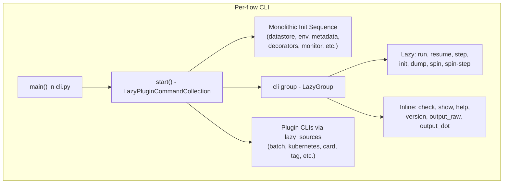
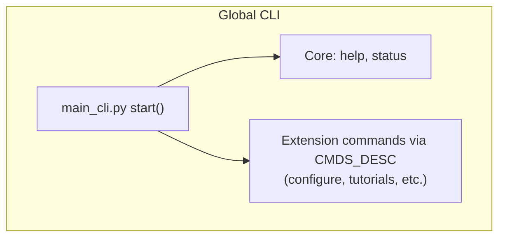

# Metaflow CLI Extensibility Proposal (Issue Draft)

## Metaflow CLI Exploration:

While exploring the Metaflow CLI internals, I looked into how extensibility currently works and where it becomes difficult for extension authors to hook into existing behavior.

Metaflow currently exposes two main CLI entry points:

- **Per-flow CLI** (`python myflow.py ...`), implemented primarily in `metaflow/cli.py`



- **Global CLI** (`metaflow ...`), implemented in `metaflow/cmd/main_cli.py`



Both already support extensions:

- The per-flow CLI loads plugin command groups via `LazyPluginCommandCollection` and `CLIS_DESC`.
- The global CLI exposes command extensions via `CMDS_DESC`.

So the CLI is already extensible in terms of **adding new commands**. However, while reading through the code and experimenting with a few changes, I noticed that **some internal execution paths are still difficult to extend**.

Below are a few areas where extension points might be useful.

## Areas Hard to Extend:

## 1. CLI startup lifecycle is monolithic

The `start()` function in `metaflow/cli.py` performs several setup stages in sequence, for example:

- datastore initialization
- metadata initialization
- decorator initialization
- environment setup
- monitor setup
- configuration loading

Since this happens inside a single control flow, extension authors currently don't have a reliable way to hook into these stages.

If someone wants to extend behavior, they would likely need to patch internal logic rather than use a stable extension point.

---

## 2. Run/Resume CLI options

Commands like `run` and `resume` define their CLI options through:

- `common_run_options`
- `common_runner_options`

in `metaflow/cli_components/run_cmds.py`.

Flow decorators already support defining **top level CLI options** via `FlowDecorator.options`

However, there isn't currently a mechanism for decorators or plugins to add **options specifically to `run` or `resume` commands**.

This makes it difficult for extensions that want to configure runtime behavior directly through the CLI.

---

## 3. CLI argument serialization exists in two places

While tracing how runtime commands are constructed, I noticed that dictionary → CLI argument serialization exists in two different places:

- `metaflow/cli_args.py`
- `metaflow/runtime.py`

Both convert dictionaries of options into CLI argument lists, but the implementations differ slightly.

# Proposed Improvements

To explore possible improvements, I implemented some changes in these three areas above.

## 1. CLI lifecycle hooks

The idea here is to introduce optional lifecycle checkpoints during CLI startup. These hooks are invoked during the startup process in `metaflow/cli.py`.

Example:

```
post_datastore
post_metadata
post_decorators
post_start
```

How it is used:

- Reuse `plugins.TL_PLUGINS` as the extension point.
- If a plugin defines `cli_init(phase, ctx)` it will be called during those phases.

Compatibility:

- Plugins that don't implement this function are unaffected.
- Existing behavior remains unchanged.

This gives extensions a stable place to hook into the CLI startup process without modifying core logic.

Changes mentioned in this PR:

## 2. Decorator-driven run/resume option extension

I experimented with allowing `FlowDecorator` to define additional CLI options for the `run` and `resume` commands in `metaflow/decorators.py`

This introduces an optional field `run_options` in `FlowDecorator`. These options are injected into `common_run_options` during command creation.

Example use case:
A decorator could define additional runtime configuration parameters that appear directly in the CLI for `run` or `resume`.

Safeguards I added:

- Option names are normalized (`foo` and `-foo` both become `-foo`)
- Dash and underscore collisions are handled (`max-workers` vs `max_workers`)
- Empty or invalid option names are rejected
- Envvar naming is normalized (`METAFLOW_RUN_<NAME>`)

Compatibility:

- Existing decorators do not need to change.
- Existing CLI behavior remains unchanged.
- This simply allows decorators to add new options if desired.

Changes mentioned in this PR:

## 3. Shared CLI argument serializer

To reduce duplication, I introduced a shared helper `dict_to_cli_args(...)` in `metaflow/util.py`. Reused it from both `metaflow/cli_args.py` and `metaflow/runtime.py`

The goal was simply to use existing logic while preserving behavior.
The helper maintains existing semantics, including:

- boolean flag handling
- `decospecs -> --with`
- config option expansion
- tuple/list argument handling

Compatibility:

- behavior remains backward compatible
- the change mainly reduces duplicated logic

Changes mentioned in this PR:

## Testing

To validate the proposed changes, I added a small unit test suite `test/unit/test_cli_extensibility.py`.

The goal was to ensure that the new extension points behave predictably and do not break existing CLI behavior.

The tests cover the three explored changes:

- lifecycle hook invocation and error handling
- decorator-defined `run`/`resume` CLI options
- shared CLI argument serialization (`dict_to_cli_args`)

All tests currently pass locally using the existing Metaflow `pytest` setup.

# My Position on the Issue

The goal of this exploration was primarily to understand the current CLI architecture and identify areas where extension points might be helpful.

Based on this, my current view is that **Metaflow’s CLI is already reasonably extensible for adding new commands**, but there are still a few internal improvements that can be made.

The three improvements explored here aim to address that:

1. **Lifecycle hooks** provide stable injection points during CLI startup.
2. **Decorator-driven run options** allow extensions to influence runtime configuration more conveniently.
3. **Shared CLI argument serialization** simplifies internal logic and reduces duplication.

All three changes were implemented to demonstrate feasibility without altering existing behavior.

My intention with these changes is not necessarily to suggest that they should be merged exactly as implemented, but rather to illustrate possible directions for making the CLI easier to extend.

I would be very interested in feedback on whether these kinds of extension points align with the long term direction of Metaflow’s CLI design.
