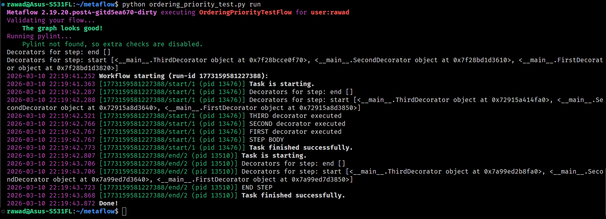
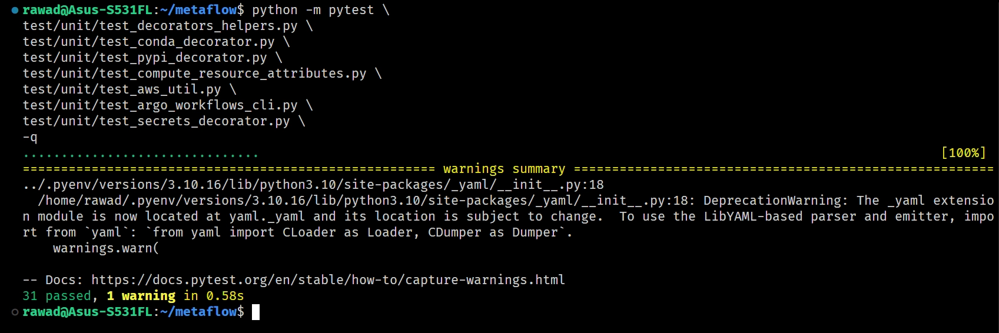

# Metaflow Decorator Lifecycle Hooks Proposal

### Issue Link: [Issue](https://github.com/saikonen/metaflow/issues/3)

### Linked PR for this issue: [PR Link](https://github.com/rawadhossain/metaflow/pull/10)

## Exploring the current decorator lifecycle

While exploring the decorator system in **Metaflow**, I looked into how decorators are initialized and how lifecycle hooks are executed during a flow run.

Metaflow decorators expose several lifecycle hooks that allow decorators to influence execution at different stages. Some of the commonly used ones include:

- `step_init`
- `runtime_step_cli`
- `task_pre_step`
- `task_finished`

These hooks are called at different points during step execution, mainly from the runtime code paths in `task.py` and `runtime.py`.

At a high level the lifecycle looks roughly like this:

```
decorators attached to step
        ↓
_init_step_decorators()
        ↓
step_init hooks
        ↓
runtime_step_cli
        ↓
task_pre_step
        ↓
task_finished
```

Decorators are stored on each step as a list (`step.decorators`), and lifecycle hooks are executed by iterating through that list.

One important observation is that **decorator execution order is determined by the order of that list**. But it is not guaranteed in all situations.

Decorators can also be attached through:

- `--with` CLI options
- decorator mutators
- extensions

These can change the order in which decorators appear internally.

Because of this, **decorators cannot reliably assume that another decorator has already run within the same stage**.

Hence the issue was raised.

# Observations from existing decorators

While reviewing the existing decorator implementations, I noticed two patterns.

1. Some decorators implicitly depend on behavior from other decorators.

    For example, the `parallel` decorator has a comment explaining why it avoids relying on environment variables that may not yet be set.

2. Several decorators repeat similar logic in the same lifecycle hooks.

Two examples appeared frequently:

### i. Metadata registration

Multiple decorators construct `MetaDatum` entries and call `metadata.register_metadata(...)`

This pattern appeared in multiple places with small variations.

### ii. Compute decorator setup

Both **Batch** and **Kubernetes** decorators share very similar logic in:

- `runtime_step_cli`
- `task_pre_step`
- `task_finished`

For example:

- appending package metadata to CLI arguments
- syncing metadata from the datastore
- starting logging or monitoring sidecars
- terminating sidecars when execution finishes

Although the environments are different, the structure of the code was very similar.

# Changes I made

I experimented with a few changes to improve the current situation while keeping **backwards compatibility**. Listing them below.

## 1. Explicit decorator ordering

To make decorator execution more predictable, I introduced a simple ordering mechanism.

Each `StepDecorator` now defines `ORDER_PRIORITY = 0`

Decorators can override this value if they need to run earlier or later relative to others.

Decorators are sorted using `(ORDER_PRIORITY, original_index)`

This ensures that:

- decorators with different priorities run deterministically
- decorators with the same priority preserve their original source order

Sorting is applied when decorator lists are finalized, specifically in:

- `_init_step_decorators`
- `_process_late_attached_decorator`

This means decorators attached dynamically go through the same ordering logic.

The goal of this change is to make decorator ordering deterministic and explicit without introducing any major architectural change.

### Validating decorator ordering behavior

To verify that the proposed ordering setup works as expected, I created a small test flow with custom decorators that implement different `ORDER_PRIORITY` values.

The decorators simply print a message during the `task_pre_step` lifecycle hook so the execution order can be observed directly.

Example test flow:

- Code

    ```python
    from metaflow import FlowSpec, step
    from metaflow.decorators import StepDecorator

    def step_deco(deco_cls):
        def decorator(func):
            if not hasattr(func, "is_step"):
                from metaflow.decorators import BadStepDecoratorException
                raise BadStepDecoratorException(deco_cls.name, func)

            if deco_cls.name in [deco.name for deco in func.decorators]:
                from metaflow.decorators import DuplicateStepDecoratorException
                raise DuplicateStepDecoratorException(deco_cls.name, func)
            func.decorators.append(deco_cls(attributes={}, statically_defined=True))
            return func
        return decorator

    class FirstDecorator(StepDecorator):
        name = "first"
        ORDER_PRIORITY = 10

        def task_pre_step(
            self, step_name, task_datastore, metadata, run_id, task_id, flow, graph, retry_count, max_user_code_retries, ubf_context, inputs
        ):
            print("FIRST decorator executed")

    class SecondDecorator(StepDecorator):
        name = "second"
        ORDER_PRIORITY = 10

        def task_pre_step(
            self, step_name, task_datastore, metadata, run_id, task_id, flow, graph, retry_count, max_user_code_retries, ubf_context, inputs
        ):
            print("SECOND decorator executed")

    class ThirdDecorator(StepDecorator):
        name = "third"
        ORDER_PRIORITY = 10

        def task_pre_step(
            self, step_name, task_datastore, metadata, run_id, task_id, flow, graph, retry_count, max_user_code_retries, ubf_context, inputs
        ):
            print("THIRD decorator executed")

    class OrderingPriorityTestFlow(FlowSpec):

        @step_deco(FirstDecorator)
        @step_deco(SecondDecorator)
        @step_deco(ThirdDecorator)
        @step
        def start(self):
            print("STEP BODY")
            self.next(self.end)

        @step
        def end(self):
            print("END STEP")

    if __name__ == "__main__":
        OrderingPriorityTestFlow()
    ```

Decorators with lower priority values run earlier. And equal priority preserve their original order

Terminal output:

Running the flow confirms this behavior.

**Note:** Python applies decorators from bottom to top, which is why the original decorator list appears in reversed order internally. Also temporarily printed decorator information for debugging.

### What `ORDER_PRIORITY` does not solve

It does **not solve dependency relationships** like `Decorator B` depends on `Decorator A.`
That would require major architectural changes and is outside the scope of this proposal

### **Summary:**

My approach does not introduce dependency relationships between decorators. It provides a way for making ordering deterministic when needed keeping existing behavior by default.

# 2. Metadata abstraction

The repeated metadata registration pattern was centralized by introducing a helper in `StepDecorator`.

introduced a helper `_register_metadata(...)` to minimize repeated metadata registration pattern

This helper handles the creation of `MetaDatum` entries and registers them with the metadata provider.

It is now used by several decorators that previously used similar logic.

The goal here was mainly to **reduce duplicated boilerplate**.

# 3. Shared helpers

In `Batch` and `Kubernetes` decorators, I noticed that many lifecycle operations were structurally identical.

To reduce duplication, a few helper methods were introduced on `StepDecorator`:

- `_append_package_metadata_to_cli`
- `_sync_local_metadata_from_datastore`
- `_start_log_and_spot_sidecars`
- `_terminate_sidecars`

Both Batch and Kubernetes decorators now reuse these helpers.

These helpers mainly affect logic inside:

- `runtime_step_cli`
- `task_pre_step`
- `task_finished`

The idea was to remove duplicated code without introducing a new base class.

# Testing

I added a small unit test suite `test/unit/test_decorators_helpers.py`

The tests cover:

- decorator ordering behavior
- metadata helper behavior
- filtering of `None` metadata values

I also ran existing tests related to decorators and compute configuration.

```
python -m pytest \
test/unit/test_decorators_helpers.py \
test/unit/test_conda_decorator.py \
test/unit/test_pypi_decorator.py \
test/unit/test_compute_resource_attributes.py \
test/unit/test_aws_util.py \
test/unit/test_argo_workflows_cli.py \
test/unit/test_secrets_decorator.py \
-q
```

Result:


# My current view on the issue

From exploring the decorator system and experimenting with these changes, my current view is that:

- Decorator lifecycle hooks themselves are already well defined.
- The main issue is that **ordering between decorators is implicit**.
- A lightweight mechanism like `ORDER_PRIORITY` can provide more predictable execution without introducing a complex dependency system.

Also, some internal improvements are possible by extracting repeated patterns that appear across decorators.

The changes described above were implemented mainly to demonstrate that these improvements are feasible while preserving existing behavior.
